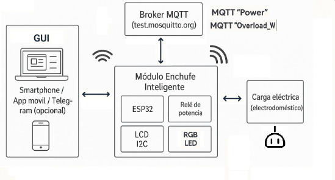
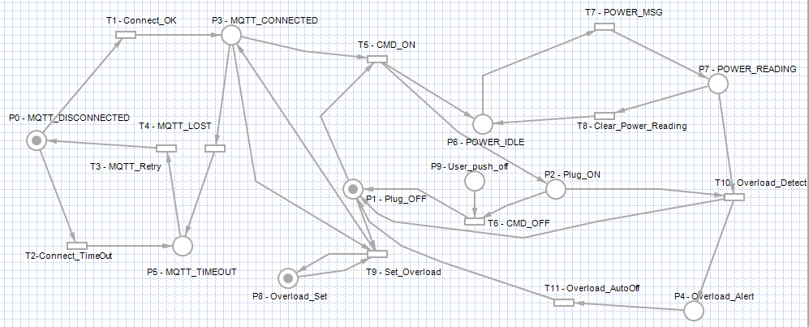
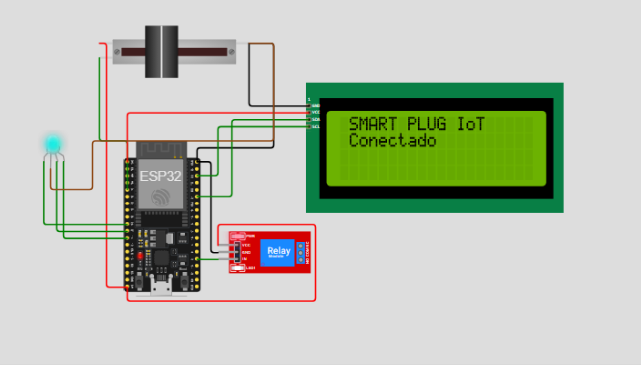
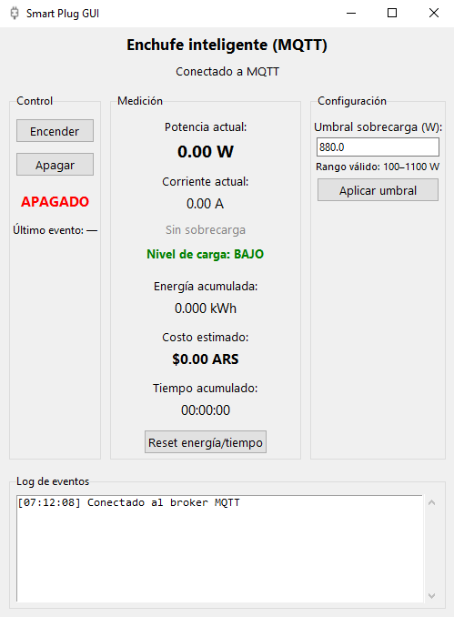
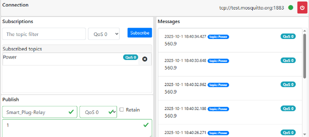
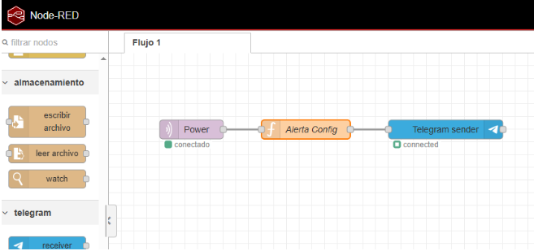

**Enchufe Smart** 

**Grupo 10**

**Materia:** Sistemas de Tiempo Real.

**Docente:** Ing. Hugo Mazzeo-

**Comisión:** S32. 

**Alumnos:** 

● Llontop, Alejandro – Legajo N° 31890\.   
● Morinigo, Roger \- Legajo N° 23920  
● Ross, Nicolás \- Legajo N°32640

## Tabla de Contenidos

-   [Introduccion](#1-introducción)
-   [Caracteristicas Generales](#2-características-generales---antecedentes---estado-del-arte)
    -   [Enchufes y domotica](#21-enchufes-inteligentes-y-domótica)
    -   [Consumo y potencia](#22-consumo-eléctrico-potencia-y-energía)
    -   [Protocolo MQTT y broker](#23-protocolo-mqtt-y-broker-mosquitto)
-   [Propuesta de trabajo](#3-propuesta-de-trabajo)
    -   [Definicion del problema](#31-definición-del-problema-a-solucionar)
         -   [Especificacion](#32-especificación)
         -   [Diagrama de bloques](#33-diagrama-de-bloques)
         -   [Simulacion](#3-4-simulación)
               -   [Red de Petri](#3-41-red-de-petri)
               -   [Simulacion por software](#342-simulación-por-software)
         -   [Particion hardware-software](#35-partición-hardwaresoftware)
               -   [Elementos Hardware](#351-elementos-de-hardware-simulados)
               -   [Elementos Software](#352-elementos-de-software)
               -   [Posible Integracion](#353-posible-integración-con-nodered-y-telegram)
-   [Conclusiones](#4conclusiones)
-   [Referencias](#5-referencias)


## 1\. Introducción 

#### 1.1 Razones que impulsaron el trabajo

El crecimiento de la domótica y del Internet de las Cosas (IoT) ha impulsado la aparición de dispositivos que permiten automatizar tareas cotidianas en el hogar. En particular, los enchufes inteligentes (smart plugs) ofrecen una forma sencilla de convertir dispositivos eléctricos convencionales en elementos controlables y monitoreables de manera remota, sin necesidad de reemplazarlos por equipos nuevos.

Al momento de definir el trabajo práctico de la materia Sistemas de Tiempo Real, el grupo buscó una idea que pudiera trasladarse a un escenario real, que permitiera medir magnitudes eléctricas, aplicar lógica de control y, al mismo tiempo, integrar comunicaciones de red para el monitoreo remoto. El enchufe inteligente IoT cumple con estos objetivos y permite trabajar con conceptos centrales de la asignatura.

#### Objetivos del trabajo 

Los objetivos principales del proyecto son:

·         \- Diseñar e implementar un prototipo de enchufe inteligente capaz de medir una señal analógica equivalente a corriente de carga, calcular la potencia consumida y publicar estos datos en tiempo real mediante MQTT.

·         \- Permitir el control remoto del enchufe (encendido/apagado) desde un cliente externo conectado al mismo broker MQTT.

·         \- Incorporar un mecanismo de protección por sobrecarga que detecte corrientes superiores a un umbral preestablecido y corte automáticamente la salida.

·         \- Desarrollar una interfaz gráfica de escritorio que permita al usuario controlar el enchufe, visualizar la potencia instantánea, integrar la energía consumida (kWh), estimar el costo económico y registrar eventos relevantes en un log.

## 2\. Características Generales \- Antecedentes \- Estado del arte

#### 2.1 Enchufes inteligentes y domótica

Un enchufe inteligente es un dispositivo que se intercala entre la toma de corriente de la red domiciliaria y la carga (por ejemplo, una lámpara, una cafetera o un cargador). Este dispositivo permite encender y apagar la alimentación de forma remota, medir variables eléctricas como corriente y potencia, y, en sistemas comerciales, integrarse con plataformas de hogar conectado.

En el mercado existen múltiples variantes de smart plugs que utilizan diferentes tecnologías de comunicación (Wi-Fi, Zigbee, Z-Wave, Bluetooth) y diferentes plataformas de gestión (Tuya, Google Home, Amazon Alexa, etc.). Muchos modelos comerciales incorporan medición de potencia y energía, y ofrecen estadísticas de consumo y alertas por sobrecarga o por anomalías.

En el presente proyecto se trabaja con un prototipo orientado a la simulación, pero con una arquitectura trasladable a un diseño físico real. El énfasis está puesto en la lógica de control, la protección por sobrecarga y la integración mediante MQTT.

#### 2.2 Consumo eléctrico, potencia y energía

La potencia activa consumida por una carga resistiva puede aproximarse como:  
 					P \= V × I

donde V es la tensión de línea (en este caso se asume 220 V constantes en la simulación) e I es la corriente consumida por la carga (simulada mediante un potenciómetro).

La energía consumida se obtiene integrando la potencia en el tiempo. En forma discreta, se puede aproximar mediante:  
 					E \[Wh\] ≈ Σ (P × Δt / 3600\)

La interfaz gráfica acumula energía en Wh, la convierte a kWh y utiliza este valor para estimar el costo económico según un valor de referencia de tarifa eléctrica.

#### 2.3 Protocolo MQTT y broker Mosquitto

MQTT (Message Queuing Telemetry Transport) es un protocolo de mensajería ligero basado en un modelo publicador/suscriptor. Es ampliamente utilizado en aplicaciones IoT debido a su bajo overhead y simplicidad. En este modelo, los dispositivos publican mensajes en tópicos específicos, mientras que otros dispositivos se suscriben a esos tópicos para recibir los datos.

En este proyecto se utiliza el broker público test.mosquitto.org, provisto por Eclipse Mosquitto. Tanto el ESP32 simulado en Wokwi como la interfaz gráfica en Python se conectan a este broker para intercambiar los mensajes necesarios para el control y monitoreo del enchufe inteligente.

## 3\. Propuesta de Trabajo 

#### 3.1 Definición del problema a solucionar 

Se plantea el diseño de un sistema de tiempo real embebido capaz de:

* Medir de forma continua la potencia consumida por una carga conectada a un enchufe.  
* Proteger la instalación frente a sobrecargas, cortando la alimentación por encima de un umbral ajustable.  
* Permitir el control remoto de la alimentación de la carga (ON/OFF).  
* Comunicar en tiempo real las mediciones a un cliente externo para monitoreo y análisis.

Desde la perspectiva de la materia, el problema se puede expresar como:

Diseñar un sistema embebido de monitoreo y control de un enchufe inteligente, con capacidades de medición de consumo eléctrico, protección por sobrecarga y comunicación en tiempo real mediante MQTT hacia una interfaz de usuario.  
Aunque el prototipo se valida íntegramente en simulación, el modelo está pensado para poder migrar a un dispositivo físico incorporando los componentes de potencia y seguridad adecuados.

#### 3.2 Especificación

La especificación funcional del sistema es la siguiente:

* Entrada analógica simulada  
  * Un potenciómetro representa la corriente de carga.  
  * El ESP32 convierte la señal ADC en un valor de corriente entre 0 A y aproximadamente 5 A.  
  * Se asume una tensión de línea constante de 220 V.  
* Cálculo y presentación de magnitudes  
  * Cálculo de potencia instantánea:  
     P \= V × I               P=V×I con V=220  V  
  * Presentación local en una LCD I2C 20x4 de:  
    * Corriente (A).  
    * Tensión (V, fija a 220 V).  
    * Potencia (W).  
    * Mensajes de estado (en línea, sobrecarga, desconectado).  
* Lógica de protección por sobrecarga  
  * Umbral configurable de sobrecarga en potencia (W) desde la GUI.  
  * Conversión de ese umbral a corriente equivalente en el ESP32.  
  * Corte automático del relé cuando la corriente supera el valor límite.  
  * Indicación de sobrecarga mediante mensaje en LCD y parpadeo del LED RGB.  
* LED RGB como indicador de nivel de carga  
  * Verde: baja carga (corriente muy por debajo del umbral).  
  * Azul: carga normal (operación en zona segura).  
  * Rojo: carga cercana al límite de sobrecarga.  
* Comunicación MQTT  
  * Publicación periódica de la potencia en el tópico Power.  
  * Recepción de comandos ON/OFF en Smart\_Plug-Relay.  
  * Recepción de umbral de sobrecarga en Smart\_Plug/Overload\_W.  
* Interfaz gráfica en Python  
  * Conectarse al mismo broker MQTT.  
  * Mostrar potencia, corriente, energía acumulada (kWh), costo estimado y tiempo de consumo.  
  * Permitir al usuario:  
    * Encender y apagar el enchufe.  
    * Configurar el umbral de sobrecarga dentro de un rango válido.  
  * Registrar en un log de eventos las acciones y eventos automáticos.

Detectar pérdida de comunicación con el equipo (timeout de lecturas).

#### 3.3 Diagrama de Bloques



* Usuario (PC con GUI / Smartphone): permite encender y apagar el enchufe, configurar el umbral de sobrecarga y visualizar potencia, energía y eventos. Se comunica solo por red usando MQTT.

* Broker MQTT (test.mosquitto.org): actúa como intermediario entre el usuario y el módulo enchufe. Gestiona los tópicos:

  * Smart\_Plug-Relay (comandos ON/OFF),

  * Smart\_Plug/Overload\_W (umbral de potencia),

  * Power (potencia medida).

* Módulo Enchufe Inteligente (ESP32 \+ relé \+ LCD I2C \+ LED RGB): mide la corriente simulada (potenciómetro), calcula potencia, muestra los datos en el LCD, indica el nivel de carga con el LED RGB y conmuta el relé que alimenta la carga eléctrica. Si la potencia supera el umbral recibido por MQTT, corta automáticamente la salida y reporta la sobrecarga.  
    
* Carga eléctrica (electrodoméstico): Representa el dispositivo conectado al enchufe (en la simulación, se simboliza con un icono de toma de corriente). Recibe la alimentación sólo cuando el relé está cerrado. Es la carga cuyo consumo está siendo medido y controlado por el sistema.


#### 3\. 4\. Simulación

###### *3\. 4.1 **Red de Petri***

 La red de Petri del modelo detallado es la siguiente

 

###### *3.4.2 Simulación por software* 

La simulación por software se realizó en dos niveles:

Simulación en Wokwi:



Para esta simulación se utilizó:

* ESP32 DevKit.  
* Potenciómetro de corriente.  
* Módulo de relé.  
* Pantalla LCD 20x4 I2C.  
* LED RGB.


\*\* El ESP32 ejecuta el firmware con la lógica de medición, protección y publicación MQTT.  
\*\* El potenciómetro se ajusta manualmente para simular variaciones de carga.

 
Simulación de la interfaz remota en Python:



En una PC con Windows se ejecuta la GUI desarrollada en Python (Tkinter \+ paho-mqtt), conectada al broker público [test.mosquitto.org](http://test.mosquitto.org).

La GUI:

* Muestra en tiempo real los datos de potencia que publica el ESP32.  
* Permite encender y apagar el enchufe.  
* Permite configurar el umbral de sobrecarga.  
* Acumula energía consumida y costo estimado.  
* Registra los eventos en un log interno.


La integración de ambas simulaciones (Wokwi \+ GUI) permitió validar el comportamiento del sistema completo sin requerir hardware físico.

 El sistema también funciona a la inversa, para monitorear la potencia el ESP32 calcula la medición y la publica en el tópico Power en que se puede ver ese valor en tiempo real en el cliente web o en una aplicación del celular. Así el servidor MQTT es el centro de comando que permite tanto activar el enchufe como mostrar su potencia instantánea .

###### 3.4.3 Como correr el proyecto

1. **Descargar el repositorio**: Clonar o descargar el repositorio del proyecto.

   ```bash
   git clone https://github.com/rfmorinigo/Smartplug-tp-str-utn
   ```

2. **Instalar dependencias**: Asegurarse de tener Python instalado y ejecutar el siguiente comando en la terminal para instalar las dependencias necesarias:

   ```bash
   pip install -r requirements.txt
   ```

3. **Montar la GUI**: Ejecutar el archivo principal de la interfaz gráfica (GUI) escrita en Python. Por ejemplo:

   ```bash
   python gui_main.py
   ```

   Esto abrirá la ventana de control del enchufe inteligente.

4. **Ingresar al proyecto Wokwi**: Abrir el siguiente enlace del simulador Wokwi donde se encuentra cargado el proyecto del ESP32:
   [https://wokwi.com/projects/ejemplo-smartplug](https://wokwi.com/projects/448227456673244161)

5. **Ejecutar simulación**: Dentro del entorno Wokwi, presionar el botón "Play / Run" para iniciar la simulación del ESP32 y la publicación de datos por MQTT.

6. **Controlar desde la GUI**: Volver a la GUI, presionar el botón "Encender". Si la conexión MQTT está activa, se comenzarán a recibir y mostrar los datos de potencia en tiempo real.

7. **Opcional - Probar sobrecarga**: En el simulador Wokwi, modificar el valor de corriente para simular una sobrecarga. En la GUI se activará la alerta correspondiente y se producirá el apagado automático.

8. **Detener el sistema**: Para finalizar la prueba, detener la simulación en Wokwi y cerrar la GUI de Python.

#### 3.5. Partición Hardware–Software

###### *3.5.1 Elementos de Hardware (simulados)*

* **Microcontrolador ESP32 DevKit**  
  * Núcleo de procesamiento.  
  * Conectividad WiFi.  
  * Conversión analógica-digital (ADC) para lectura del potenciómetro.  
* **Módulo de relé**  
  * Actuador que representa el corte o restitución de la alimentación hacia la carga.  
* **Potenciómetro de corriente**  
  * Sensor analógico simulado para modelar la corriente de carga.  
* **Pantalla LCD 20x4 con interfaz I2C**  
  * Dispositivo de visualización local de datos y mensajes de estado.  
* **LED RGB**  
  * Indicador visual del nivel de carga y de condiciones cercanas a la sobrecarga.

###### *3.5.2 Elementos de Software*

* **Firmware del ESP32 (C/C++)**  
  * Gestión de la conexión WiFi.  
  * Gestión del cliente MQTT (PubSubClient).  
  * Lectura periódica del ADC.  
  * Cálculo de corriente y potencia.  
  * Lógica de control del relé y protección por sobrecarga.  
  * Manejo de la LCD y del LED RGB.  
  * Publicación y suscripción de mensajes MQTT.  
* **Broker MQTT (Eclipse Mosquitto – test.mosquitto.org)**  
  * Servicio intermedio que gestiona la distribución de mensajes entre el ESP32 y la GUI.  
* **Interfaz de usuario en Python**  
  * Implementada con **Tkinter** y **paho-mqtt**.  
  * Cálculo de corriente a partir de la potencia y la tensión fija.  
  * Integración de energía en el tiempo y cálculo de costo estimado.  
  * Manejo de umbral de sobrecarga, validaciones y envío al ESP32.  
  * Registro de eventos y supervisión de comunicación (timeout de lecturas).  
    

###### *3.5.3 Posible integración con NodeRed y Telegram*

NodeRed



Node-Red es una herramienta de programación basada en flujo, diseñada para facilitar la conexión de dispositivos (IoT), APIs y servicios en línea. 

Podemos usar Node-RED como el cerebro de la seguridad del Smart Plug para procesar la información del ESP32 y enviar una notificación al celular a través de Telegram.

Nos suscribimos al tópico **Power** en el servidor **test.mosquitto.org**. Cada vez que la ESP32 publica un nuevo valor de potencia (ejemplo: 950 W), este nodo lo recibe y lo inyecta en el flujo. Luego, el código toma el valor de potencia, lo compara con el límite de sobrecarga (ejemplo: 800 W) y, solo si el valor es superior, crea un nuevo mensaje que contiene el texto de la alerta que se envía por Telegram.




Integración Telegram \+ NodeRed


Si bien esta alternativa basada en Node-RED y Telegram fue considerada durante las etapas iniciales del diseño, se optó por una interfaz gráfica de escritorio desarrollada en Python por su mayor simplicidad de integración, control directo y visualización unificada. Esta decisión permitió concentrar las funcionalidades clave en una única aplicación, facilitando la implementación, pruebas y mantenimiento del sistema. De todos modos, la arquitectura planteada es completamente escalable: en una evolución futura, esta GUI podría adaptarse a plataformas móviles utilizando entornos como Android Studio o Kivy, o bien complementarse con herramientas como Node-RED para agregar automatización distribuida y notificaciones en tiempo real a través de mensajería instantánea. Esta flexibilidad refuerza el valor del diseño modular del sistema.


## 4.Conclusiones 

El proyecto Enchufe Inteligente IoT logró integrar múltiples tecnologías de hardware y software para crear un sistema embebido de monitoreo y control en tiempo real. Se consiguió medir la corriente de carga simulada y calcular la potencia eléctrica consumida de forma continua, publicando estos datos mediante el protocolo ligero MQTT, lo que permitió un monitoreo remoto eficiente. La elección de MQTT resultó acertada dado que es un estándar ampliamente usado en IoT por su bajo overhead y modelo publish/subscribe ideal para dispositivos con recursos limitados.

El broker público Eclipse Mosquitto (test.mosquitto.org) funcionó como concentrador confiable de mensajes, demostrando la viabilidad de usar infraestructuras abiertas para prototipos.

En la simulación con Wokwi (ESP32), el sistema reaccionó en tiempo real a cambios en la carga (potenciómetro) y envió actualizaciones instantáneas al cliente. Se implementó con éxito la protección por sobrecarga: al superar la corriente umbral, el firmware del ESP32 cortó la salida simulada y notificó la condición. Este mecanismo refleja el comportamiento de enchufes inteligentes comerciales, que apagan el suministro y alertan al usuario ante exceso de consumo

La integración con la interfaz gráfica de Python (Tkinter) permitió al usuario visualizar la potencia instantánea y la energía acumulada (conversión a kWh y estimación de costo), así como encender/apagar el enchufe remotamente. El software de escritorio, apoyado en la librería Paho-MQTT, mostró ser capaz de suscribirse y publicar mensajes MQTT de forma robusta, actualizando los datos en pantalla y registrando eventos en un log.

En términos educativos y técnicos, el proyecto sintetiza conceptos clave de sistemas en tiempo real e IoT. Se aplicaron principios de sistemas embebidos (concurrencia, temporización de lecturas), se utilizó un microcontrolador ESP32 ampliamente usado en IoT, y se manejaron protocolos y plataformas actuales (MQTT, brokers, dashboards). La realización en un entorno de simulación permitió iterar de forma segura y repetir pruebas sin riesgo de dañar hardware, lo cual resultó valioso para el aprendizaje. Asimismo, la precisión de las mediciones y cálculos fue verificada, coincidiendo con hallazgos de trabajos similares donde los enchufes inteligentes IoT demuestran lecturas de consumo confiables.

En conclusión, el desarrollo del enchufe inteligente IoT cumplió con los objetivos propuestos, entregando un prototipo funcional en tiempo real que monitoriza, protege y reporta el uso de energía de una carga. Este trabajo práctico no solo valida la factibilidad técnica de integrar sensado, control y comunicación IoT, sino que aporta una experiencia formativa integral al consolidar conocimientos de electrónica, programación de microcontroladores, protocolos de red y desarrollo de interfaces de usuario para sistemas ciber-físicos conectados.

## 5\. Referencias

   
**OASIS/ MQTT.org** – *“MQTT: The Standard for IoT Messaging”*. OASIS Standard, 2014 mqtt.org. \- (descripción oficial del protocolo MQTT, ligero y orientado a IoT).

**Eclipse Mosquitto Project** – *“Eclipse Mosquitto – An open source MQTT broker”*. Eclipse Foundation, 2025 \- [mosquitto.org](https://mosquitto.org/#:~:text=Eclipse%20Mosquitto%20is%20an%20open,board%20computers%20to%20full%20servers) (documentación del broker MQTT utilizado, con soporte para dispositivos de baja potencia).

**Wokwi Docs** – *“Welcome to Wokwi\!”*. Wokwi (CodeMagic Ltd), 2025 \- [docs.wokwi.com](https://docs.wokwi.com/#:~:text=Welcome%20to%20Wokwi%21). (simulador online de electrónica utilizado para prototipar el ESP32 y periféricos en el proyecto).

**Espressif Systems** – *“ESP32 – Wi-Fi & Bluetooth SoC”*. Espressif Product Page, 2025 \- [espressif.com](https://www.espressif.com/en/products/socs/esp32#:~:text=ESP32). (Características del microcontrolador ESP32, con conectividad Wi-Fi/Bluetooth para aplicaciones IoT).

**Python Software Foundation** – *“Graphical User Interfaces with Tk (Tkinter)”*. Documentación oficial de Python 3, 2025 \- [docs.python.org](https://docs.python.org/3/library/tk.html#:~:text=Tk%2FTcl%20has%20long%20been%20an,extension%2C%20the%20%2011%20module) (referencia sobre Tkinter, la biblioteca estándar utilizada para la GUI de escritorio).

**Eclipse Paho** – *“Eclipse Paho Python Client – MQTT v5.0/3.1.1”*. Eclipse Foundation, 2023 \- [eclipse.dev](https://eclipse.dev/paho/clients/python/#:~:text=Python%20Client) (documentación de la librería Paho-MQTT en Python empleada para conectividad MQTT en la interfaz gráfica).

**TP-Link** – *“Introducción a la función de Monitoreo de Energía del enchufe Tapo (Power Protection)”*. TP-Link FAQ 3490, actualización 2025 \- [tp-link.com](https://www.tp-link.com/us/support/faq/3490/#:~:text=Scenario%207%3A%20Tapo%20Power%20Protection)[tp-link.com](https://www.tp-link.com/us/support/faq/3490/#:~:text=,notification%20to%20your%20mobile%20device) (explica la característica de protección por sobrecarga en un enchufe inteligente comercial).

**Node-RED Project** – *“About Node-RED – Flow-based programming for IoT”*. OpenJS Foundation, 2023 \- [nodered.org](https://nodered.org/about/#:~:text=Node,part%20of%20the%20OpenJS%20Foundation)[nodered.org](https://nodered.org/about/#:~:text=Node,IBM%E2%80%99s%20Emerging%20Technology%20Services%20group) (sitio oficial de Node-RED, herramienta considerada como posible integración para flujos IoT y alertas en el proyecto).

**Link al proyecto (WokWi)** - https://wokwi.com/projects/448227456673244161

**Link al repositorio (GitHub)** - https://github.com/rfmorinigo/Smartplug-tp-str-utn